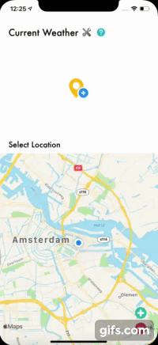
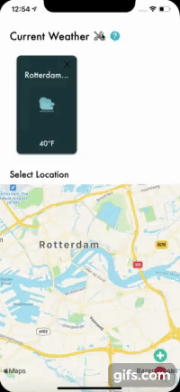
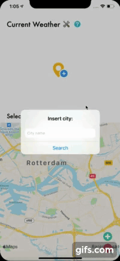
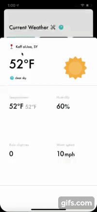
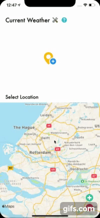

# Weather Forecast

Weather Forecast is a iOS App for consulting the weather information.

## Installation

This project is available to download at Github. Click [here](https://gifs.com/gif/1WnMEZ).

## Usage

After opening the project, run the scheme WeatherForecast to simulate the app.

## Issues
At Github is possible to see all issues that I created to organize my tasks.

## Features Implemented
The map at the **home screen** shows the current user location.

Next to the **Current Weather** title, the settings and help options are available.

Inside the **Current Weather Section** it's possible to search for locations.

To see the weather details, select a location.

Inside the **Select Location Section**, it's possible to zoom in and zoom out. To add a location, press inside the map to add a new pin. If you click inside an existed pin, it will be removed from the map.

